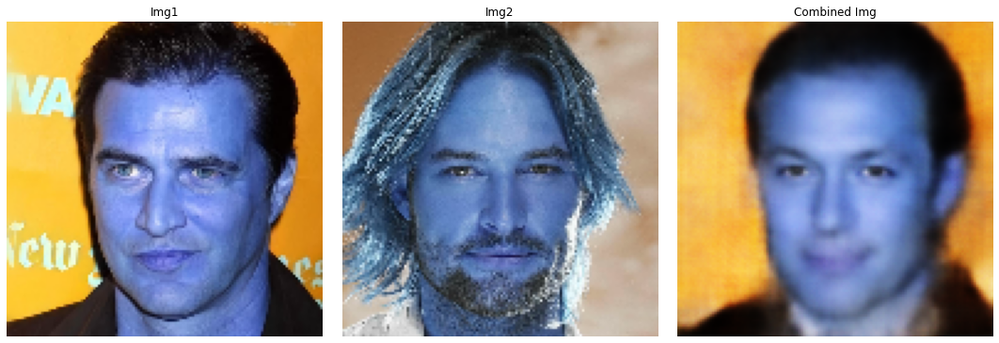
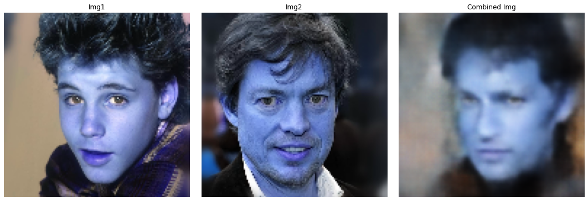
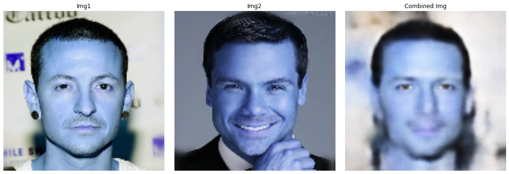

# Face-GAN

This project is inspired by the paper ["StarGAN: Unified Generative Adversarial Networks for Multi-Domain Image-to-Image Translation"](https://arxiv.org/abs/1711.09020).

In this work, I aim to transfer facial features—such as expression, lighting, and facial details—from a secondary image to a primary image while preserving the originality of the primary image.

---

## Dataset

To train the model, you'll need the CelebHQ-A dataset. Follow these steps:

1. Download the dataset by running the following command:
   ```bash
   bash download.sh celeba-hq-dataset
   ```

2. After this you will have a zip folder ("celeba_hq") inside "data" folder. Please extract it 

3. The data set would be in this format:
    data/ └── celeba_hq/ 

## Training 

1. To train the model run 
    ```bash
    python train.py --data_path /path/to/data --output_path /path/to/output
    ```
2. For example run the script in this manner:
    ```bash
    python train.py --data_path ./data --output_path ./output
    ```

## Testing 

For testing check the "test.ipynb" file

## Results

Below are the results showcasing the feature transfer:

- The **first image** is the primary input.
- The **second image** is the secondary input.
- The **third image** is the generated output.

### Example Outputs:

#### Result 1:


#### Result 2:


#### Result 3:


